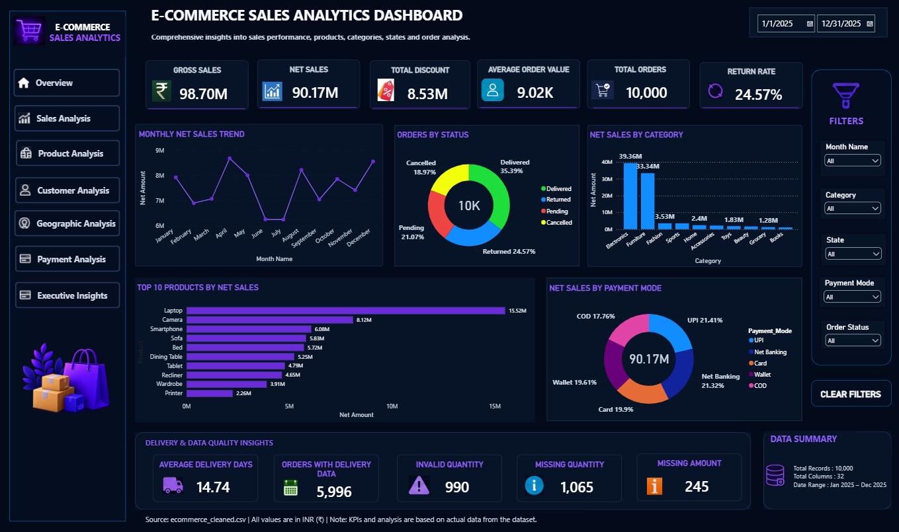
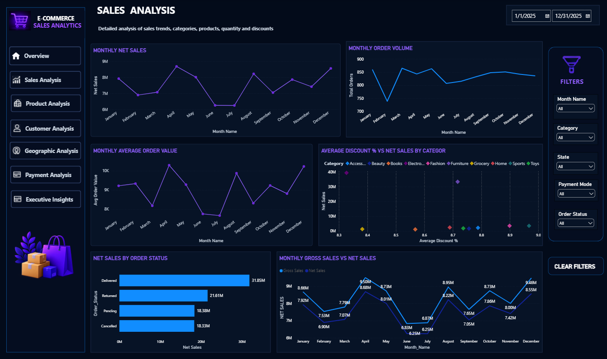
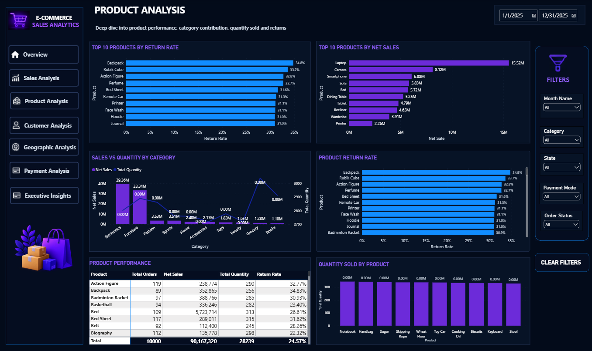
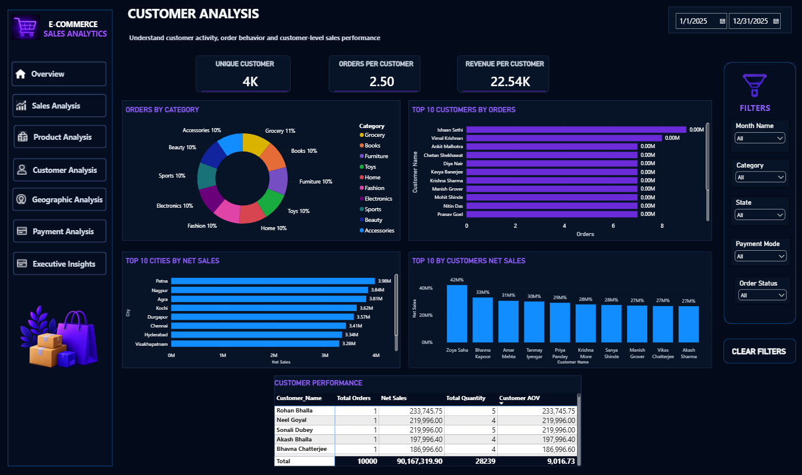
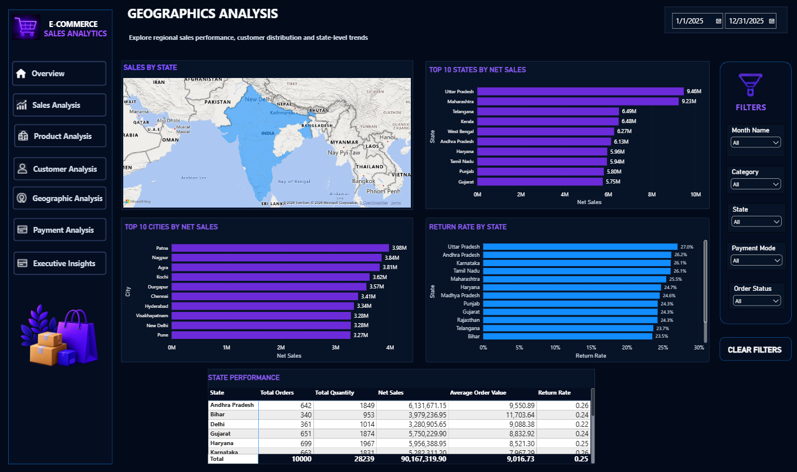
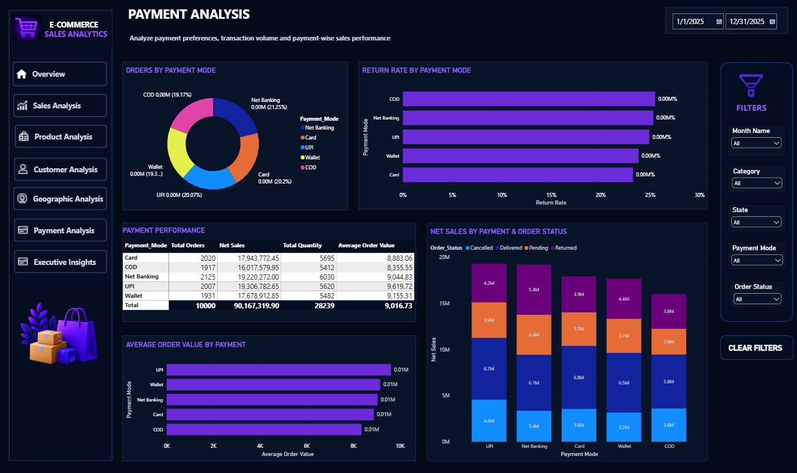
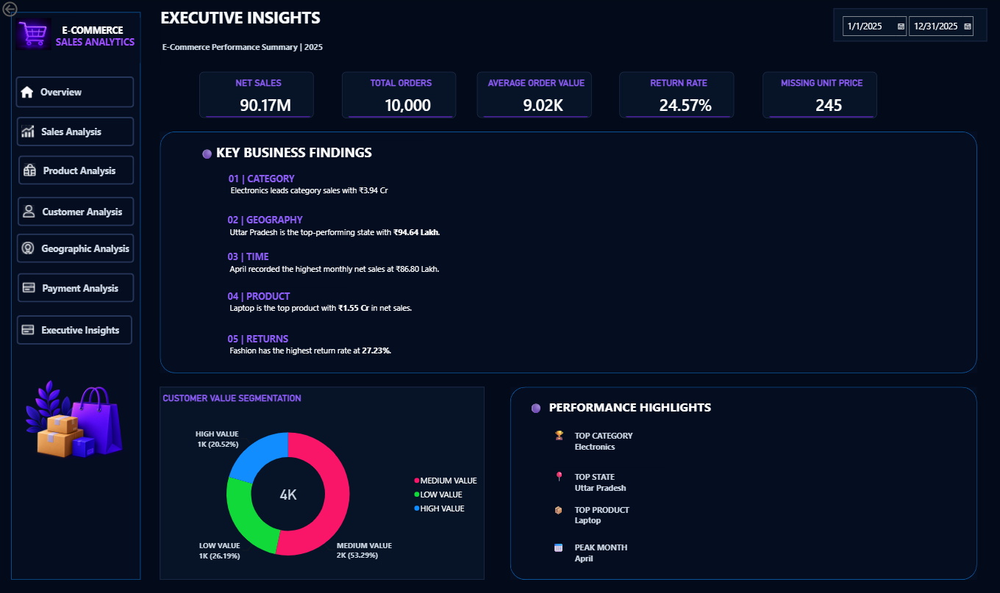

# 🛒 E-Commerce Sales Analytics

**Python • MySQL • SQL • Power BI**

An end-to-end **E-Commerce Sales Analytics** project that transforms **10,000 raw transactional records** into validated business insights through Python-based data cleaning, MySQL/SQL analysis, and interactive Power BI dashboards.

### 🔄 End-to-End Workflow

**Raw Excel Data → Python Cleaning → Data Quality Validation → MySQL → SQL Analysis → Power BI → Business Insights**

---

## 📌 Project Overview

This project analyzes e-commerce transactions to understand:

* Sales and revenue performance
* Customer purchasing behavior
* Product and category performance
* State and city performance
* Payment preferences
* Order status and cancellations
* Discount impact
* Delivery performance
* Data quality and KPI consistency

A key focus of the project is **data-quality validation**.

Instead of simply deleting incomplete or invalid records, dedicated **data-quality flags** were created to preserve visibility into the original data issues and allow them to be analyzed separately.

---

## 📊 Key Performance Indicators

| Metric                  |      Value |
| ----------------------- | ---------: |
| Total Orders            |     10,000 |
| Total Customers         |      4,001 |
| Total Cities            |         30 |
| Total Quantity          |     28,239 |
| Gross Sales             |    ₹98.70M |
| Total Discount          |     ₹8.53M |
| Net Sales               |    ₹90.17M |
| Average Order Value     |  ₹9,016.73 |
| Discount Percentage     |      8.64% |
| Cancellation Percentage |     18.97% |
| Average Delivery Time*  | 14.74 days |
| Fastest Delivery*       |      1 day |
| Longest Delivery*       |    29 days |

*Delivery metrics are calculated using records with available delivery-date information.

---

## 🎯 Business Questions

The project answers questions such as:

* What are the overall sales and order trends?
* Which products and categories generate the highest sales?
* Who are the highest-spending customers?
* Which states and cities contribute the most sales?
* Which payment modes are most frequently used?
* What percentage of orders are cancelled?
* How do discounts affect sales and order value?
* What is the average delivery time?
* How many records contain missing or invalid values?
* Are sales, discount, and net-amount calculations mathematically consistent?

---

# 🧹 Data Cleaning & Quality Validation

Python was used to clean, validate, transform, and prepare the raw Excel dataset for analysis.

### Data Quality Checks

The following issues were identified and validated:

* Missing quantity
* Invalid quantity
* Missing unit price
* Missing discount
* Missing phone number
* Invalid phone number
* Missing delivery date
* Duplicate Order IDs
* Financial calculation inconsistencies

### Data-Quality Flags

Instead of deleting problematic records, dedicated flags were created:

* `Email_Missing`
* `Qty_Missing`
* `Qty_Invalid`
* `Discount_Missing`
* `Phone_Missing`
* `Phone_Valid`
* `Unit_Price_Missing`
* `Delivery_Date_Missing`
* `Is_Returned_Stock`

### Financial Calculations

```text
Sales = Quantity × Unit Price

Discount Amount = Sales × Discount / 100

Net Amount = Sales − Discount Amount

Delivery Days = Delivery Date − Order Date
```

---

## ⚠️ Data Quality Summary

| Data Quality Issue    | Records |
| --------------------- | ------: |
| Missing Quantity      |   1,065 |
| Invalid Quantity      |     990 |
| Missing Unit Price    |     245 |
| Missing Discount      |   1,236 |
| Missing Phone         |     413 |
| Missing Delivery Date |     391 |
| Duplicate Order IDs   |       0 |

This approach preserves the original data issues while preventing them from being hidden during analysis.

---

# 🗄️ MySQL & SQL Analysis

The cleaned dataset was imported into **MySQL** for structured analysis, business querying, and independent KPI validation.

### Business KPIs

* Orders
* Customers
* Quantity
* Gross Sales
* Discounts
* Net Sales
* Average Order Value

### Product & Category Analysis

* Category-wise sales
* Product performance
* Quantity sold
* Average order value

### Customer Analysis

* Customer spending
* Top customers
* Customers with more than five orders
* Customer-level order behavior

### Geographic Analysis

* State-wise sales
* City-wise sales
* Order volume
* Customer distribution

### Payment Analysis

* UPI
* Card
* COD
* Wallet
* Net Banking

### Order Status Analysis

* Delivered
* Returned
* Pending
* Cancelled
* Cancellation percentage

### Time & Discount Analysis

* Yearly sales
* Monthly sales
* Weekday performance
* Discount-level performance
* Discounted vs. non-discounted orders

### Delivery Analysis

* Average delivery days
* Fastest delivery
* Longest delivery
* Delivery performance by order status

SQL was also used to independently validate the financial calculations used in the Power BI dashboard.

---

# 💡 Key Business Insights

* The dataset contains **10,000 orders from 4,001 customers**, enabling analysis at both transaction and customer levels.
* Gross sales of **₹98.70M** resulted in **₹90.17M net sales** after discounts.
* Total discounts amounted to approximately **₹8.53M**, representing **8.64% of gross sales**.
* The average order value was **₹9,016.73**.
* **18.97% of orders were cancelled**, providing a measurable view of order-status performance.
* Average delivery time was **14.74 days** among records with available delivery dates.
* Quantity and discount fields contained notable data-quality issues, highlighting the importance of validation before KPI reporting.
* **No duplicate Order IDs** were identified.

---

# 📈 Power BI Dashboard

The Power BI report contains **7 analytical pages**.

### 1. Overview

High-level KPIs covering sales, orders, customers, products, categories, and states.

### 2. Sales Analysis

Sales trends, category performance, products, quantity, and discount analysis.

### 3. Product Analysis

Product and category performance, quantity sold, and returns.

### 4. Customer Analysis

Customer activity, order behavior, and customer-level sales performance.

### 5. Geographic Analysis

State-level sales, customer distribution, and regional performance.

### 6. Payment Analysis

Payment preferences, transaction volume, and payment-wise sales.

### 7. Executive Insights

Consolidated e-commerce performance summary.

---


## 📷 Dashboard Preview

### 1. Overview



### 2. Sales Analysis



### 3. Product Analysis



### 4. Customer Analysis



### 5. Geographic Analysis



### 6. Payment Analysis



### 7. Executive Insights



---

# 🛠️ Tools & Technologies

| Technology       | Purpose                         |
| ---------------- | ------------------------------- |
| Python           | Data cleaning & transformation  |
| Pandas           | Data manipulation               |
| NumPy            | Numerical operations            |
| OpenPyXL         | Excel handling                  |
| Jupyter Notebook | Data-cleaning workflow          |
| MySQL            | Database & data storage         |
| SQL              | Business analysis & validation  |
| Power BI         | Interactive dashboards          |
| GitHub           | Documentation & version control |

---

# 🔄 Project Workflow

```text
Raw Excel Data
       ↓
Python Data Cleaning & Transformation
       ↓
Data Quality Validation
       ↓
Cleaned CSV
       ↓
MySQL Database
       ↓
SQL Analysis & KPI Validation
       ↓
Power BI Dashboard
       ↓
Business Insights
```

---

# 📁 Project Structure

```text
Ecommerce-Sales-Analytics/
│
├── Dataset/
│   ├── Raw/
│   │   └── ecommerce_raw.xlsx
│   └── Cleaned/
│       └── ecommerce_cleaned.csv
│
├── Python/
│   └── data_cleaning.ipynb
│
├── SQL/
│   └── ecommerce_analysis.sql
│
├── Powerbi/
│   └── ecommerce_dashboard.pbix
│
├── Screenshots/
│   ├── 01_Overview.png
│   ├── 02_Sales_Analysis.png
│   ├── 03_Product_Analysis.png
│   ├── 04_Customer_Analysis.png
│   ├── 05_Geographic_Analysis.png
│   ├── 06_Payment_Analysis.png
│   └── 07_Executive_Insights.png
│
├── Data_Dictionary.xlsx
├── requirements.txt
├── .gitignore
└── README.md
```

---

# 🚀 How to Reproduce

## 1. Clone the Repository

```bash
git clone https://github.com/shubhangii07/Ecommerce-Sales-Analytics.git 
cd Ecommerce-Sales-Analytics
```

## 2. Install Dependencies

```bash
pip install -r requirements.txt
```

## 3. Run Data Cleaning

Open:

```text
Python/data_cleaning.ipynb
```

The notebook reads:

```text
Dataset/Raw/ecommerce_raw.xlsx
```

and generates:

```text
Dataset/Cleaned/ecommerce_cleaned.csv
```

## 4. Set Up MySQL

Create the database:

```sql
CREATE DATABASE ecommerce;
```

Create/import the `orders` table and load the cleaned CSV.

## 5. Run SQL Analysis

Execute:

```text
SQL/ecommerce_analysis.sql
```

## 6. Open Power BI

Open:

```text
Powerbi/ecommerce_dashboard.pbix
```

Connect to the required data source and refresh the dataset.

---

# 🚀 Future Improvements

* RFM customer segmentation
* Customer churn analysis
* Profit and margin analysis
* Predictive sales analysis
* Time-series forecasting
* Automated data-quality reporting
* Power BI Service deployment
* Scheduled dashboard refresh

---

# 👤 Author

**Shubhangi Desai**

**Data Analyst | Python | SQL | Power BI**

---

# ⭐ Project Highlights

* End-to-end analytics workflow
* 10,000 transactional records
* Python-based data cleaning
* Dedicated data-quality validation
* MySQL database integration
* SQL business analysis
* Independent KPI validation
* Interactive 7-page Power BI dashboard
* Business-focused insights

---

### 🔗 End-to-End Analytics

**Raw Data → Clean Data → SQL Analysis → Power BI → Business Insights**
